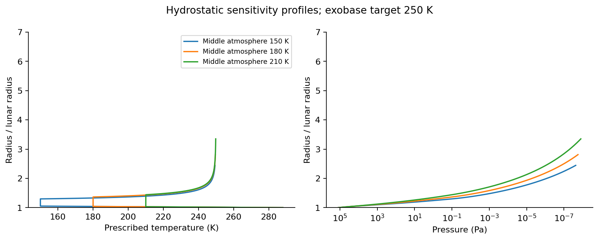
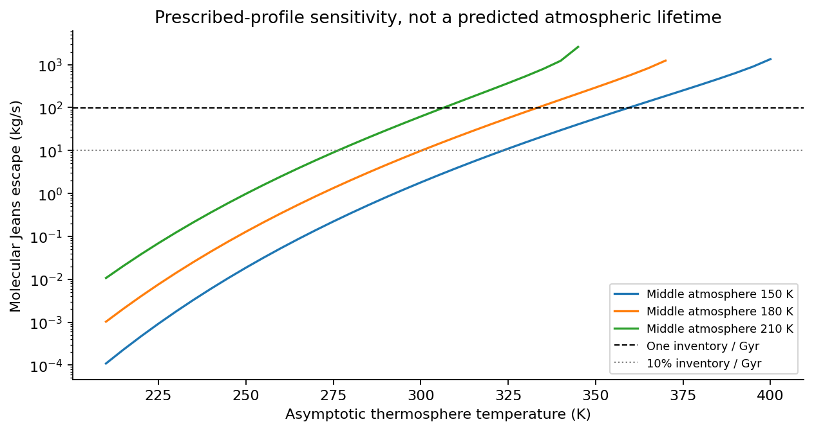
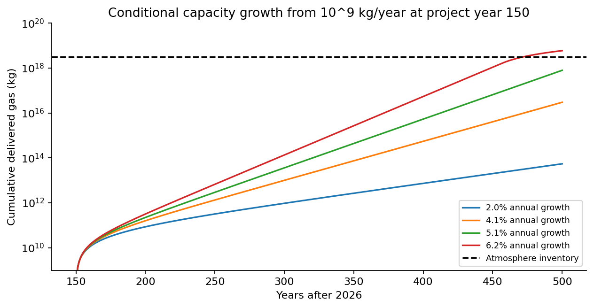
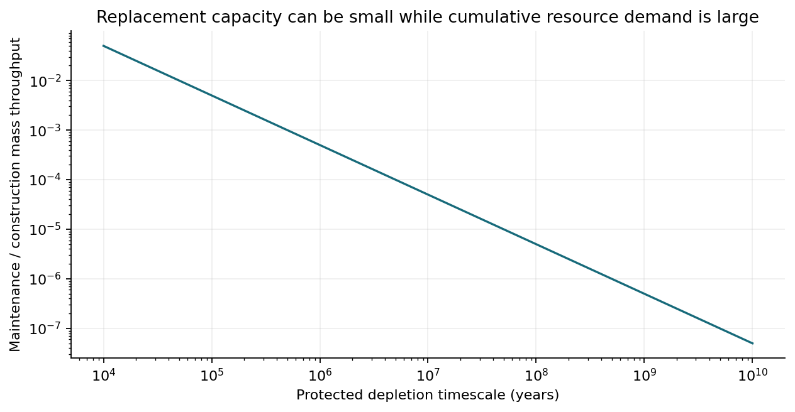

# Lunar terraforming: integrated feasibility assessment

## A 1.2-atmosphere open Moon, construction within 500 years, and operation for at least one billion years

Prepared for Daniel Goldman | 4 September 2026 | Version 1.0

This report evaluates the physical and technological requirements of constructing and maintaining a substantial, breathable lunar atmosphere, with particular emphasis on aerial habitation and an aerial biosphere. It includes a reproducible numerical sensitivity model and explicitly distinguishes calculations from demonstrated technology and unresolved science.

The project has no pressure dome. No superconducting planetary rings are assumed. Distributed protection nodes remain an architectural option, subordinate to protecting the lunar atmosphere and surface. The 500-year limit is measured from 2026; calculations using exactly 500 years are optimistic ceiling cases, not allowance for completing after that limit.

## Executive assessment

The concept remains physically possible in the limited sense that this study identifies no universal law excluding a cold, protected, dense lunar atmosphere. An integrated construction and maintenance design has not yet been demonstrated. The most defensible classification is **conditional physical feasibility, unclosed engineering feasibility, and highly uncertain schedule feasibility**.

The numerical work changes three conclusions from the preliminary discussion. First, a spherical atmosphere with the specified surface pressure requires about **3.14 x 10^18 kg** in the reference profile, approximately 11% above the constant-gravity estimate. Second, molecular Jeans escape at a prescribed 250 K exobase can be very small; the claim that 260 K necessarily limits retention to tens of millions of years is unsupported. Third, representative electric-propulsion transport budgets reach **tens to hundreds of petawatts**, substantially exceeding an estimate based only on payload kinetic energy.

The 250 K target is potentially valuable because it can keep molecular thermal escape small. However, atmospheric chemistry, the location of the cold and warm layers, atomic enrichment, particle-driven loss and water escape determine whether that result survives in a real atmosphere. Specifying a cold exobase does not establish that a realizable optical shield can produce it.

Resource supply is an independent bottleneck. The reference atmosphere contains approximately **2.53 x 10^18 kg of nitrogen** and **6.13 x 10^17 kg of oxygen**. Oxygen can be extracted from lunar minerals, but a high-yield process, energy supply and protected disposition of reduced metal products are required. Nitrogen requires a major extraterrestrial supply chain. At Bennu's measured approximately 0.24 wt% nitrogen, ideal recovery would require about **1.05 x 10^21 kg of feedstock**. Concentrated outer-system nitrogen deposits or atmospheres reduce excavation, but impose more demanding transport, local power and source-depletion constraints.

**Maintenance can plausibly fit within the construction technology envelope.** Replenishment at 100 kg/s is only about one two-millionth of the average atmosphere construction rate over 500 years. Replacing optical films could also require far less material than initial atmospheric construction. Sustained propulsive stationkeeping, however, can consume more mass than atmospheric replenishment. A billion-year architecture should strongly favor gravitationally useful trajectories, solar-sail control, material recycling and replaceable modules.

The project cannot currently be described as likely to finish within 500 years. A conditional growth calculation can meet that limit if an extraterrestrial industry delivering 10^9 kg/year at year 150 grows about 5.6% annually, eventually reaching approximately 10^17 kg/year. Those figures concern net delivery of the correct atmospheric gases, not generic mining output. They assume simultaneous scaling of energy, extraction, transport, braking, manufacturing, repair and control.

| Decision | Finding | Confidence |
| --- | --- | --- |
| Can a 1.2-atm inventory physically be accumulated? | No basic mass or energy prohibition identified | Moderate |
| Is 250 K intrinsically insufficient for retention? | No; molecular-only models support very low thermal loss | High for the stated model; low for a real atmosphere |
| Is the 250/260 K lifetime cliff established? | No | High |
| Can the atmosphere and climate coexist under a realizable shield? | Not yet established | Unresolved |
| Are adequate resources known to exist in the Solar System? | Yes in aggregate; no closed project supply chain | Moderate |
| Is a 500-year build justified as a forecast? | No; it is a demanding conditional scenario | High |
| Could a construction-capable civilization maintain the system? | Plausibly, subject to optical/orbital and recycling closure | Moderate |
| Can billion-year autonomous continuity be guaranteed? | No available basis for such a guarantee | High |

## 1. Requirements, assumptions and the meaning of viability

The requested outcome has three separate success conditions: construction of an open lunar environment in less than 500 years; maintenance of useful surface and aerial conditions; and continued operation for at least one billion years. They cannot be collapsed into a single atmospheric lifetime.

**Physical viability** means that mass, energy, chemistry, radiative balance and orbital mechanics permit a solution. **Engineering viability** means that a specific architecture closes its power, material, heat, control and reliability budgets. **Schedule viability** means the complete supply chain can be developed and scaled before the deadline. **Long-term viability** requires sustainable resources and replacement of all essential infrastructure. Economic and institutional viability remain additional conditions; credible monetary forecasts over five centuries are unavailable.

| Parameter | Reference value | Status |
| --- | --- | --- |
| Surface pressure | 1.2 atm = 121,590 Pa | User requirement |
| Surface temperature | 288 K reference; regional climate unresolved | Analysis assumption |
| Dry oxygen mole fraction | 17.5% | Starting design choice |
| Dry nitrogen mole fraction | 82.5% | Starting design choice |
| Oxygen partial pressure | 0.21 atm at reference elevation | Consequence of composition |
| Exobase target | Approximately 250 K | User preference, tested conditionally |
| 260 K upper limit | A candidate engineering target | No validated lifetime threshold |
| Cold middle atmosphere | 150, 180 and 210 K sensitivity cases | Prescribed, not predicted |
| Thermosphere heating onset | 0.001, 0.1 and 10 Pa sensitivity cases | Prescribed, not predicted |
| Water inventory | 10 and 100 m global-equivalent cases | Open project choice |
| Radiation objective | At most 0.027 mSv/day | Previously stated project target |
| Construction | Less than 500 years from 2026 | User requirement |
| Continued operation | At least 10^9 years | User requirement |

The oxygen fraction is a starting composition rather than a completed fire-safety or physiological specification. Oxygen partial pressure, total pressure, dilution, humidity and materials all affect combustion. An Earthlike oxygen partial pressure alone does not reproduce every terrestrial combustion condition.

Argon or other heavier buffer gases could be studied, but substituting them would require a new resource budget and biological assessment. This report retains nitrogen to avoid silently changing the user's intended environment. Helium and hydrogen are lifting-gas possibilities inside vehicles, not proposed atmospheric constituents in bulk.

The report uses primary research and engineering studies, with source links in Section 18. Own calculations are labeled as such. No coupled three-dimensional climate, photochemistry, plasma-interaction or particle-transport simulation was run. Those omissions limit the conclusions; they do not prevent calculating inventories, conditional loss rates, resource requirements, transport budgets and architecture constraints.

## 2. Atmospheric mass, depth and the aerial environment

For a thin atmosphere in constant gravity, the mass is M = 4 pi R^2 p0 / g0. At lunar radius 1,737.4 km and GM = 4.902800118 x 10^12 m^3/s^2, this gives 2.84 x 10^18 kg. A deep atmosphere requires declining gravity and the increasing area of spherical shells.

Hydrostatic balance and the ideal-gas law give dp/dr = -rho GM/r^2 and rho = p mu/(Ru T). Defining x = ln(p0/p), the radius follows d(1/r)/dx = -Ru T/(mu GM). The atmospheric mass is then obtained from M = (4 pi/GM) integral(r^4 p dx). The vertical mass column uses integral(r^2 p dx)/GM. These expressions are implemented in the supplied model.

In the reference profile, the lower atmosphere follows a dry adiabat until 180 K, remains at that prescribed minimum until 0.1 Pa, and then approaches 250 K over three pressure e-foldings. This prescription provides an internally hydrostatic sensitivity case. It does not demonstrate radiative or convective equilibrium for the actual gas mixture.

| Reference result | Value |
| --- | --- |
| Integrated atmospheric mass | 3.14 x 10^18 kg |
| Nitrogen mass | 2.53 x 10^18 kg |
| Oxygen mass | 6.13 x 10^17 kg |
| Surface density at 288 K | 1.458 kg/m^3 |
| Near-surface scale height | 51.3 km |
| Near-surface dry adiabatic lapse rate | 1.62 K/km |
| Vertical column mass | 78,700 kg/m^2, approximately 7,870 g/cm^2 |
| Exobase radius in the molecular reference case | 2.81 lunar radii |

Changing the prescribed middle-atmosphere temperature from 150 to 210 K changes total mass by less than 1% in these cases, while changing the exobase position and escape much more strongly. The inventory is dominated by the low atmosphere. The loss rate is controlled by a much smaller mass at high altitude.

The density advantage for aerial vehicles is real, but low gravity must be applied correctly. Static balloon support satisfies m = (rho_air - rho_lift) V after subtracting envelope and equipment mass. Gravity cancels because it acts on both displaced air and the vehicle. The reference helium balloon has approximately **1.25 kg/m^3 of gross mass lift** at the surface. Higher air density supplies the direct buoyancy increase; reduced structural loads can provide additional design advantages.

For a fixed vehicle mass, wing area and lift coefficient, aerodynamic flight speed scales as sqrt(g/rho). The reference lunar-to-terrestrial ratio is **0.373**. Lower weight also helps airborne organisms, while slower gravitational settling can extend the residence of small suspended particles. These relations support the aerial-environment motivation without proving that a self-sustaining airborne food web or giant flying organism will emerge.

An extended atmosphere is not uniformly habitable with altitude. The reference profile reaches about 100 kPa at 10 km altitude, 50 kPa at 41 km and 10 kPa at 100 km. Its temperature has already fallen to about 223 K at 41 km. Tall atmospheric structure creates room for flight, but temperature and oxygen availability still constrain open-air habitation. Moist convection would alter these example heights and temperatures.

Cloud and circulation dynamics require explicit modeling. The equatorial solar terminator moves at approximately 4.3 m/s. At winds of 10-100 m/s, a hemisphere-scale crossing takes approximately 6.3-0.63 days, shorter than the roughly 14.8-day daylight interval. These are transport times, not predicted wind speeds. Weak rotation relative to such circulation favors broad day-night and meridional flows; familiar terrestrial weather patterns should not be imposed by analogy.

## 3. Climate, water and atmospheric chemistry

A 1.2-atm lunar atmosphere carries roughly 7.6 times Earth's sea-level atmospheric mass column in the reference model. Its thermal inertia helps suppress temperature swings, but greenhouse absorption, clouds and surface coupling determine how much of that capacity actually participates in the diurnal cycle.

The supplied linear thermal-response model solves C d(delta T)/dt + B delta T = F1 cos(omega t), with a 29.53-day period. It assumes a forcing amplitude of 200 W/m^2 and tests atmospheric coupling fractions, mixed-layer water depth and outgoing-radiation slopes. It is a heat-capacity sensitivity calculation, not a lunar climate prediction.

| Coupled atmosphere | Mixed-layer water | Temperature amplitude at B = 2 W/m^2/K |
| --- | --- | --- |
| 10% of column | None | 10.2 K |
| Whole column | None | 1.0 K |
| 10% of column | 10 m | 1.6 K |
| Whole column | 10 m | 0.67 K |

The calculation establishes that a long lunar night does not automatically imply atmospheric collapse. It also shows why vertical coupling cannot be left unspecified. Land, ocean and cloud-covered regions will differ. Published ancient lunar simulations demonstrate that global circulation calculations are practical, but their 1-10 mbar results do not validate a 1.2-atm nitrogen-oxygen climate. [S01]

Nitrogen and oxygen are comparatively weak infrared absorbers. Surface warmth would depend on water vapor, carbon dioxide, collision-induced absorption, clouds and the selected visible/infrared transmission of the shield. An Earthlike trace-gas mixing ratio cannot be presumed to yield an Earthlike greenhouse effect in a much deeper column. A radiative-convective grid should initially span approximately 10-1,000 ppm CO2, multiple humidity distributions and several water inventories, before a three-dimensional model narrows the choices.

Water accounting must include atmosphere, lakes or oceans, groundwater, hydrated minerals and ice. Ten meters of global-equivalent liquid water requires 3.79 x 10^17 kg; 100 meters requires 3.79 x 10^18 kg. A geographically concentrated ocean can have a shallow global-equivalent inventory while remaining locally deep. Neither value is an established ecological minimum.

The upper atmosphere should be kept dry enough to limit water photolysis and hydrogen escape. A cold middle atmosphere can help by condensing water before it reaches high altitude. Whether the cold trap remains effective depends on convection, humidity, background gas abundance and the altered solar spectrum. Work on terrestrial water loss demonstrates the importance of this coupling. [S02]

A 250 K exobase does not gravitationally retain free hydrogen for geological times. The relevant target is to restrict hydrogen production and supply to the escaping region, or to replace the lost water economically. Hydrogen escape must be included in the mass budget separately from nitrogen and oxygen escape.

Filtering ultraviolet also changes ozone production, ozone destruction and biological surface exposure. An artificial shield could take over part of ozone's protective function, but then shield outages change both the energy input and the chemical state. Spectral control should preserve useful visible light while explicitly managing ultraviolet bands; it should not be specified as a single percentage of total sunlight.

The surface is another chemical reservoir. Oxygen reacts with reduced minerals and freshly exposed material. Nitrogen enters nitrates, biomass and sediment. Carbon dioxide is exchanged through dissolution, weathering and biological cycling. The long-term balance must use atmospheric input minus escape minus sequestration plus recycling. Pressure stability alone would not establish a stable oxygen fraction or climate.

## 4. Thermal escape: what the numerical model establishes

The exobase is approximated by a mean free path equal to the local scale height: Kn = 1. The reference neutral collision cross section, 5.5 x 10^-19 m^2, is an illustrative CO-derived proxy adopted from lunar escape modeling, not a measured effective cross section for every constituent of the proposed atmosphere. [S03]

For each gas, the Jeans flux is Phi = n sqrt(kT/(2 pi m)) (1 + lambda) exp(-lambda), where lambda = GMm/(kTr). The model multiplies that flux by 4 pi r^2 and molecular mass. It retains an Earthlike molecular mixture in the first calculation, then separately tests diffusive separation and imposed atomic abundances.

The primary reference result is **0.128 kg/s of molecular Jeans loss** at an exobase temperature of 249.6 K. Dividing the atmosphere by this rate gives 7.8 x 10^11 years. That enormous number is only an inventory-to-current-thermal-loss ratio under prescribed conditions. It is not a prediction that the atmosphere, shield, Sun or biosphere would remain unchanged for that period.

| Middle temperature | Upper target | Exobase radius / R | Molecular loss | Inventory / loss |
| --- | --- | --- | --- | --- |
| 150 K | 250 K | 2.44 | 0.019 kg/s | 5.3 x 10^12 yr |
| 180 K | 250 K | 2.81 | 0.128 kg/s | 7.8 x 10^11 yr |
| 210 K | 250 K | 3.35 | 0.978 kg/s | 1.0 x 10^11 yr |
| 180 K | 260 K | 2.94 | 0.343 kg/s | 2.9 x 10^11 yr |
| 180 K | 300 K | 3.63 | 9.82 kg/s | 1.0 x 10^10 yr |
| 180 K | 350 K | 5.67 | 294 kg/s | 3.4 x 10^8 yr |

The 350 K row is approaching the regime where a simple hydrostatic/Jeans approximation is less trustworthy; the molecular nitrogen Jeans parameter is only about 4.8. Some hotter profiles do not reach a collisionless boundary before 30 lunar radii. They are marked as outside the model's usable hydrostatic domain rather than assigned an invented lifetime.

Earth also lowers the escape barrier. An approximate Earth-Moon Hill radius is 61,500 km. A restricted-three-body barrier correction K = 1 - 3/(2 xi) + 1/(2 xi^3), with xi equal to Hill radius divided by exobase radius, gives K approximately 0.881 for the reference case. Applying that reduced barrier to the otherwise fixed nitrogen Jeans expression increases its flux by about 4.45 times. This is a directional tidal sensitivity, not a globally averaged escape solution; the full model needs Sun-Earth-Moon geometry. It does not overturn the low molecular-loss result, but it matters when allocating a stringent total-loss budget.

The old 250/260 K claim fails as a universal rule. At fixed exobase radius and density, increasing nitrogen's temperature from 250 to 260 K changes the Jeans factor by roughly a few, not automatically by orders of magnitude. A sharp change can arise through coupled expansion or chemistry. The temperature of the cold middle atmosphere and where heating begins are therefore important design parameters alongside the exobase temperature.

This is consistent with the methodological lesson of the lunar escape literature: the exobase must be determined for the actual atmosphere. Surface Jeans calculations, a single molecular-speed comparison and an assumed fixed escape rate cannot establish retention. [S03]

Atmospheres with stronger escape require fluid/kinetic treatment. Published combined models show why boundary conditions and kinetic escape need to be reconciled rather than selecting a convenient outflow condition at infinity. [S04] The present study does not substitute its hydrostatic model for that calculation.

## 5. Atomic enrichment, nonthermal loss and the true retention budget

Molecular nitrogen can remain relatively well bound while atomic nitrogen, atomic oxygen and hydrogen escape more readily. Dissociation changes both molecular mass and cooling. Above the homopause, lighter constituents can become enriched as molecular diffusion exceeds turbulent mixing.

The second model starts at 0.1 Pa and integrates the diffusive-equilibrium partial pressures of N2, O2, N and O separately along a prescribed radial temperature profile. Atomic abundances at that boundary are imposed sensitivity parameters. The calculation includes their effect on mean particle mass and the exobase condition, but not chemistry, diffusion-limited supply, escape-induced depletion or energy balance.

| Upper target | Imposed atomic number fraction at 0.1 Pa | Atomic fraction near exobase | Total Jeans loss |
| --- | --- | --- | --- |
| 250 K | 0 | 0 | 0.188 kg/s |
| 250 K | 10^-6 | 0.00235 | 0.312 kg/s |
| 250 K | 10^-4 | 0.227 | 13.1 kg/s |
| 260 K | 10^-4 | 0.238 | 21.9 kg/s |
| 300 K | 10^-4 | 0.303 | 144 kg/s |
| 250 K | 0.01 | No exobase below 30 R | Model does not close |

The strong enrichment is the significant result, not the precision of the rates. The 250 K, 10^-4 case has a current-rate depletion timescale around 7.6 billion years, but exceeds a stringent limit of 10% unreplenished loss per billion years. Higher atomic fractions require a flow model. The calculations do not establish what atomic abundance a real shielded atmosphere would attain.

A complete loss ledger must include molecular thermal escape, atomic thermal escape, photodissociation products with excess kinetic energy, dissociative recombination, ion pickup and outflow, sputtering, impact erosion and water-derived hydrogen escape. Established escape reviews describe these separate channels and the measurements needed to constrain them. [S05]

A magnetic field affects charged particles and their trajectories; it does not directly bind the neutral atmosphere or block EUV photons. Intrinsic magnetization can also create escape pathways. Its net benefit must be evaluated in a coupled ionosphere-plasma model rather than assumed from field strength. [S06]

For a solar-wind sensitivity illustration, take proton density 5 cm^-3 and speed 400 km/s. The incident flux is about 2 x 10^12 protons/m^2/s. Over a cross section of radius 3 R, loss of one nitrogen atom per incident proton would correspond to approximately 4 kg/s. An effective yield of 0.1-10 atoms would span roughly 0.4-40 kg/s. These values are a budget translation, not sputtering predictions; real coupling, shielding and energy thresholds determine the yield.

The reference inventory permits about **99.5 kg/s** averaged over a billion years if one entire inventory may be replaced or lost. Limiting uncompensated loss to 10% requires **9.95 kg/s**; limiting it to 1% requires about **1 kg/s**. The project should choose the total-loss budget first, then allocate it among mechanisms and maintenance requirements.

## 6. Solar filtering and heat balance of the upper atmosphere

The required technology is spectral and spatial protection, followed by a solved thermal response. The relevant heating term has the form Q = integral(F_lambda times transmission_lambda times absorption_lambda times heating_efficiency_lambda d_lambda). Photochemical rates require photon number flux, species cross sections and product yields, not just energy flux.

A historical present-Sun benchmark integrated over 0.1-118 nm is 4.64 x 10^-3 W/m^2. Its variability and wavelength dependence matter; it is not the entire ultraviolet spectrum. The same study shows that solar high-energy output and bolometric luminosity evolve differently. [S07]

For scale only, the energy-limited expression is mass loss approximately eta pi R_abs^3 F_XUV/(GM), if launch and absorption radii are identified and cooling is represented by an effective efficiency. It is not a reliable direct escape prediction for this cool nitrogen-oxygen atmosphere. Detailed studies show that radiative cooling can substantially alter energy-limited expectations. [S08]

| Absorption radius | Unfiltered energy-equivalent loss at eta = 0.1 | Transmission corresponding to 10 kg/s | Rejection |
| --- | --- | --- | --- |
| 1.5 R | 5,260 kg/s | 0.00190 | 99.81% |
| 2 R | 12,500 kg/s | 0.000802 | 99.92% |
| 3 R | 42,100 kg/s | 0.000238 | 99.976% |
| 5 R | 195,000 kg/s | 0.0000513 | 99.995% |

These are screening targets for a specified simplified energy budget. They are neither established minimum attenuation requirements nor proof that meeting them produces 250 K. Unmodeled heating, atmospheric cooling and nonthermal escape can move the requirement in either direction. The code varies effective efficiency from 0.01 to 0.3.

The reference hydrostatic profile places unit optical depth at roughly 1.67-2.13 R for hypothetical effective absorption cross sections of 10^-22-10^-20 m^2. These are parameterized opacity cases. A real spectral calculation must account for the different abundance and cross section of each absorber at each wavelength.

A viable filter needs measured transmission across soft X-rays, EUV, dissociating ultraviolet, visible light and infrared; known degradation rates; and an acceptable pressure from absorbed or redirected sunlight. Thin transparent films and coatings provide relevant materials experience, but radiation exposure degrades optical properties and existing experiments do not validate a lunar-scale lifetime. [S09]

Distributed magnetic or plasma nodes alone cannot solve the photon-filtering problem. For reflection by a simple plasma cutoff, 100 nm radiation would require electron densities of order 10^29 m^-3, approaching condensed-matter densities. Sparse interplanetary plasma cannot serve as a broadband EUV mirror merely by being magnetized. Absorption by a deliberately maintained material cloud is a different mechanism and would need its own column, replenishment and optical-control budgets.

Two optical families remain candidates. A selective screen could absorb or divert harmful wavelengths while transmitting much of the visible spectrum. Alternatively, an opaque or partly opaque screen could provide strong rejection while separate reflectors restore the desired illumination. The latter relaxes filter selectivity but adds a large optical-routing system and more dependence on active control. Neither architecture is selected as demonstrated by this report.

## 7. Shield geometry, orbit control and distributed nodes

Protecting the solid lunar disk is insufficient if upper-atmosphere heating at several lunar radii dominates the escape budget. For an opaque circular screen a distance d sunward of the target, a first geometric requirement is R_screen approximately R_protected + d tan(alpha_sun), with alpha_sun about 0.00465 radians. This includes the finite solar disk but excludes pointing margin, diffraction, gaps and extended coronal emission.

| Protected radius | Screen distance | Approximate diameter | Area | Film mass at 10 g/m^2 |
| --- | --- | --- | --- | --- |
| 3 R | 60,000 km | 10,982 km | 9.47 x 10^13 m^2 | 9.47 x 10^11 kg |
| 3 R | 1.5 million km | 24,374 km | 4.67 x 10^14 m^2 | 4.67 x 10^12 kg |

These are geometric examples, not stable orbital solutions. The 60,000 km example lies near the scale of the Moon's Hill region; Earth perturbations are essential. A permanent Moon-Sun L1 point cannot be treated as though the Moon were an isolated planet. Earth-Moon L1 rotates relative to sunlight and does not continuously occupy the required sunward line.

Likewise, placing a screen near Sun-Earth L1 does not make it track the Moon automatically. A disk that covers the Moon's entire projected orbital envelope would be hundreds of thousands of kilometers across and would also affect Earth. A smaller moving screen would need to follow the lunar target through the relevant projection. A monthly transverse displacement of order 384,000 km has an acceleration scale around 0.003 m/s^2. That is a scale estimate, not a complete trajectory calculation.

At 1 AU the radiation pressure on a fully absorbing surface is about 4.54 microPa. A total areal mass of 10 g/m^2 therefore gives only 4.54 x 10^-4 m/s^2 of acceleration for full absorption; a highly transmitting spectral filter receives less. Separate sails, orbital phasing or propulsion may be necessary. Force direction and solar-sail attitude constraints must be included. Research on non-Keplerian sail control supplies methods, not a ready-made lunar solution. [S10]

The lifecycle consequence is substantial. For the 1.5-million-km example, a sustained corrective acceleration of 10^-4 m/s^2 would consume about **9,330 kg/s of propellant** at 50 km/s exhaust speed. At 0.003 m/s^2 it becomes about **280,000 kg/s**. The corresponding idealized electrical powers at 70% efficiency are about 17 and 500 TW. Over a billion years, even the smaller propellant stream totals about 3 x 10^20 kg.

Thus screen mass alone is a misleading measure of feasibility. Optical films can be a small construction inventory while the trajectory consumes an excessive continuing resource stream. The preferred design objective is low-propellant or propellant-free control, with acceptable spectral transmission and reliable overlapping coverage.

Modular swarms offer graceful replacement, redundancy and expansion toward the user's Earth-Moon corridor concept. They also introduce gaps, collision avoidance, calibration, communications and formation-control demands. Their optical coverage needs to be demonstrated for every protected part of the atmospheric volume, throughout the lunar cycle. A cloud of small spacecraft has been studied for Earth shading, which establishes a useful architectural precedent but does not validate this mission. [S11]

A magnetic-node subsystem could reduce selected charged-particle fluxes. Solar-wind dynamic pressures of 2-20 nPa correspond to magnetic pressure balance at about 71-224 nT at the obstacle boundary. This is only an edge-field criterion. At 70 nT, proton gyroradii are approximately 65 km at 1 keV, 21,000 km at 100 MeV and 81,000 km at 1 GeV. A structure effective against solar wind therefore need not protect an inhabited interplanetary corridor against energetic particles or cosmic rays.

Large artificial-magnetosphere proposals remain engineering concepts with unresolved plasma and implementation questions. [S12] The report assigns no guaranteed particle-rejection percentage and adopts no planetary ring layout.

## 8. Surface radiation and biological viability

The atmospheric column is likely to be the dominant passive protection of the eventual surface. In the reference model it is approximately 7,870 g/cm^2. This is enough material that a substantial particle cascade must be transported through the entire atmosphere to calculate residual dose. It is inappropriate to extrapolate a thin-spacecraft shield curve or apply an exponential attenuation factor to all cosmic rays.

High-energy interactions generate neutrons, muons and other secondary particles. Lunar surface material also contributes albedo particles. Established thick-shielding studies and NASA transport work show why material composition and secondary production matter. [S13, S14] The analysis therefore does not assign a surface dose without a Geant4, PHITS or suitably validated transport calculation.

The user's 0.027 mSv/day target is treated as an engineering requirement. It should be checked across altitude, latitude, solar cycle and exceptional solar events, and should specify whether it includes natural radionuclide exposure. Aircraft and aerial settlements at different heights have different overlying columns. A comfortable surface dose would not automatically validate every proposed flight altitude.

Before the atmosphere is complete, personnel and equipment still require local shielding. This construction-stage requirement does not imply a pressure dome around the terraformed Moon. Existing lunar measurements establish a relevant exposed-surface radiation environment, but do not predict the final atmosphere's dose. [S15]

Atmosphere and radiation protection also do not resolve the biological effects of lifelong one-sixth gravity. An orbital mouse study found that lunar gravity prevented one muscle response to microgravity while failing to prevent another. [S16] That is evidence of different biological thresholds, not validation of lifelong human or animal health. Multigenerational reproduction and development remain a separate research gate. [S17]

Lunar material can support some plant growth under experimental conditions, but Apollo-regolith experiments showed substantial stress responses. [S18] Agriculture and ecosystems would require nutrient cycling, processed substrates, microbial communities, water management and control of reactive or abrasive dust. This is a major ecological construction program in addition to adding gases.

The aerial-life objective is physically attractive because of lower wing loading, reduced settling and a deep atmosphere. Nutrient supply, condensation, freezing, ultraviolet exposure, food webs and reproductive cycles would determine which organisms can occupy it. A 500-year engineering project could establish selected ecosystems, but a stable global biosphere cannot be inferred from flight mechanics alone.

## 9. Oxygen production, coproducts and surface sinks

Two oxygen-production approaches must be budgeted separately. Hydrogen reduction of ilmenite is comparatively selective; molten regolith electrolysis can access a much larger fraction of the oxygen in mixed oxides. Combining the favorable yield of one with the favorable energy estimate of the other would invent a process that has not been demonstrated.

A published end-to-end hydrogen-reduction analysis gives 24.3 +/- 5.8 kWh per kg of liquid oxygen for feed containing 10 wt% ilmenite. [S19] The stoichiometric reaction FeTiO3 + H2 -> Fe + TiO2 + H2O liberates one oxygen atom per formula unit for recovery. Before practical losses, 10 wt% ilmenite therefore yields only about 1.05 wt% oxygen from bulk feed. Producing the reference oxygen inventory would involve roughly **5.8 x 10^19 kg of bulk material**. Beneficiation reduces reactor feed but does not eliminate the excavation of rejected material.

Molten regolith electrolysis has laboratory support and reactor-sizing studies. [S20, S21] A project assumption of 35 wt% recovered oxygen would require approximately **1.75 x 10^18 kg of feedstock**, over thirty times less excavation than the ilmenite example. That recovery fraction is a design assumption requiring validation across real feedstocks, electrodes, anodes, operating temperatures and continuous separation of products.

| Oxygen case | Bulk feed | Equivalent depth at 3,000 kg/m^3 over the Moon | Energy status |
| --- | --- | --- | --- |
| 10 wt% ilmenite, ideal selective reduction | 5.8 x 10^19 kg | About 510 m | Published process benchmark available |
| 35 wt% net recovery from mixed oxides | 1.75 x 10^18 kg | About 15 m | Project assumption; process energy unclosed |

The 24.3 kWh/kg benchmark implies approximately 3.40 PW averaged over 500 years, or 5.66 PW over 300 years. A wider prospective process-energy sensitivity of 10-100 kWh/kg gives about 2.3-23 PW over 300 years. The lower end is an aggressive assumption, not a certified process.

The reduced coproducts matter as much as the gas. Exposing freshly produced metals and silicon to the new oxygen atmosphere can reverse the chemical separation. They must be used in protected structures, stored under suitable conditions or passivated in a way that does not consume the bulk oxygen inventory. Chemical energy retained in reduced materials is also not the same as immediate waste heat.

Native rock oxidation is another potential oxygen sink. As an illustrative upper-capacity calculation, converting FeO to Fe2O3 consumes about 0.111 kg of added oxygen per kg of FeO. If the top 100 m of globally averaged rock had 10 wt% reactive FeO, its full oxidation capacity would be about 1.3 x 10^17 kg of oxygen, around one-fifth of the reference atmospheric oxygen inventory. Actual accessibility and rates require mineralogical and weathering measurements. This is a capacity bound, not an assumed rapid loss.

Producing oxygen biologically would also require a carbon ledger. Net accumulation through photosynthesis requires reduced carbon to remain out of contact with oxygen; respiration and decay reverse the reaction. Producing 6.13 x 10^17 kg of O2 through net carbon fixation corresponds stoichiometrically to approximately 2.30 x 10^17 kg of retained carbon. Biology can contribute, but it does not remove the resource and redox constraints.

## 10. Nitrogen and water supply chains

Nitrogen is the principal imported atmospheric component in the reference architecture. Lunar regolith measurements are commonly tens to roughly one hundred parts per million. [S22] Even at 100 ppm with ideal recovery, the nitrogen inventory would require processing about 2.5 x 10^22 kg, a substantial fraction of the Moon. The measured surface abundance cannot be extrapolated through the whole Moon; implanted nitrogen is especially associated with exposed material. Local nitrogen is useful for early settlements but is not a credible primary source for this atmosphere on present evidence.

Bennu samples contain 0.23-0.25 wt% nitrogen. [S23] At 0.24% and complete recovery, the required feed is approximately 1.05 x 10^21 kg; at 50% recovery it doubles. The comparison is roughly a dwarf-planet-scale processing project. Bennu itself is a tiny sample target relative to that demand; its composition is evidence about one material type, not proof of a mineable reservoir with that aggregate mass.

| Source family | Why it is relevant | Principal limitation |
| --- | --- | --- |
| Lunar regolith | Nearby and already being processed | Very low nitrogen concentration |
| Carbonaceous asteroids | Accessible inner-system material; measured nitrogen | Huge ore requirement at measured concentrations |
| Ceres or similar ammoniated bodies | Ammonium-bearing minerals detected | Bulk nitrogen inventory and recoverability uncertain |
| Cometary ammonia and ammonium salts | Potentially richer nitrogen carriers | Abundance, heterogeneity and extraction uncertainty |
| Titan's atmosphere | Large, directly identified N2 reservoir | Harvesting scale, gravity wells and outer-system transport |
| Pluto/Triton and other N2-rich ices | Concentrated nitrogen avoids dilute ore | Inventory uncertainty, long logistics and weak local sunlight |

Spectroscopic evidence of ammoniated phyllosilicates on Ceres supports a source class, not a reserve estimate. [S24] Cometary ammonium-salt measurements similarly support nitrogen-bearing material without establishing the delivered cost or industrial yield for selected objects. [S25]

Titan is an important benchmark. Its approximately 1.5-bar atmosphere, radius about 2,575 km and gravity about 1.35 m/s^2 imply a thin-atmosphere mass near **9 x 10^18 kg**. The reference lunar nitrogen requirement is therefore of order **one-quarter to one-third of Titan's atmospheric inventory**, rather than a negligible skim. The atmosphere is nitrogen-dominated but contains methane and other constituents that must be separated. [S26] Extraction would alter the source and its operating conditions; a fixed-composition infinite reservoir model would be inappropriate.

Published Pluto inventory estimates place Sputnik Planitia nitrogen at approximately (0.4-3) x 10^20 mol, corresponding to roughly **1.1-8.4 x 10^18 kg of N2**. [S27] The lunar requirement is comparable to that broad range. This makes concentrated nitrogen ice potentially relevant but prevents claiming Pluto as a comfortably oversized, precisely measured reserve. Other bodies would require their own inventory assessment.

Ammonia delivery introduces a useful chemical option and a potential accounting trap. Producing 2.53 x 10^18 kg of N2 from NH3 requires about 3.07 x 10^18 kg of ammonia and produces about 5.4 x 10^17 kg of hydrogen if cracked. Burning that hydrogen to water consumes approximately 4.3 x 10^18 kg of oxygen, far more than the final atmospheric oxygen inventory. The water produced can be useful, but the additional oxygen and reaction heat must be budgeted. Raw ammonia should not simply be oxidized into the atmosphere without this accounting.

Water-rich sources can provide oxygen as well as hydrogen. If large water inventories are already being imported, electrolytic oxygen production could reduce local mineral processing. It also competes with the desired hydrosphere and leaves hydrogen that must be used, retained or discharged. Source optimization must solve the joint N-H-O-C material balance rather than pricing nitrogen and water independently.

## 11. Transfers, propulsion, cargo retention and braking

The supplied transport model first computes circular coplanar Hohmann transfers from representative heliocentric distances to 1 AU. These are reference trajectories only. They omit inclination, eccentricity, departure from a moon or planet, Earth capture, lunar targeting, finite-thrust losses, empty-vehicle return and launch-window scheduling.

| Source distance | Flight time | Outer departure impulse | Arrival speed relative to Earth's heliocentric motion |
| --- | --- | --- | --- |
| 2.77 AU | 1.29 yr | 4.86 km/s | 6.32 km/s |
| 5.2 AU | 2.73 yr | 5.64 km/s | 8.79 km/s |
| 9.58 AU | 6.08 yr | 5.44 km/s | 10.30 km/s |
| 30.1 AU | 30.7 yr | 4.05 km/s | 11.65 km/s |
| 39.5 AU | 45.6 yr | 3.69 km/s | 11.81 km/s |

The final column is not the lunar landing velocity. Earth and Moon gravity and the chosen capture architecture alter the encounter. Titan additionally requires extracting gas through an atmosphere and escaping Titan and Saturn. A Pluto route adds local escape and is not accurately represented by a circular coplanar approximation. Gravity assists and low-energy pathways can reduce some impulses, but impose timing and throughput constraints that require an explicit traffic plan.

Ordinary chemical propulsion is a poor default for the entire bulk stream. A 15.7 km/s ideal total impulse with 4.5 km/s exhaust speed has a mass ratio around 33 before tankage or dry vehicle mass. Source-derived propellant can help the supply chain, but does not eliminate its mass and energy cost.

For ideal constant-exhaust-speed electric propulsion, propellant per delivered dry kilogram is exp(delta-v/ve)-1 and electrical energy is [ve^2/(2 eta)] times that propellant ratio. The calculation assumes 70% conversion into jet kinetic energy and neglects vehicle dry mass. It is therefore optimistic for a complete fleet and avoids treating one-half of payload speed squared as the entire propulsion cost.

| Total impulse | Exhaust speed | Propellant/delivered mass | Electrical energy | Nitrogen transport power over 300 yr |
| --- | --- | --- | --- | --- |
| 10 km/s | 10 km/s | 1.72 | 123 MJ/kg | 32.8 PW |
| 10 km/s | 30 km/s | 0.396 | 254 MJ/kg | 67.9 PW |
| 10 km/s | 50 km/s | 0.221 | 395 MJ/kg | 106 PW |
| 20 km/s | 30 km/s | 0.948 | 609 MJ/kg | 163 PW |
| 20 km/s | 50 km/s | 0.492 | 878 MJ/kg | 235 PW |

The lower rows do not exhaust possible technologies. Mass drivers, beamed propulsion, solar sails, reusable tethers and energy recovery may reduce consumables or external power, but each needs a closed momentum, material and traffic budget. Nuclear electric or fusion propulsion could improve outer-system operations; neither should be assumed to have achieved the necessary specific mass, reliability or production scale.

Transported N2 or NH3 must survive transit. Bare ice entering stronger sunlight experiences sublimation and outgassing. Containers, insulation, reflectors, controlled boiloff or active refrigeration introduce mass and power. Multi-decade routes magnify these demands. Propulsion and cargo thermal control must be assessed together.

The amount of cargo simultaneously in transit can be large. A 300-year nitrogen build from a source with a six-year trip places about 2% of the entire delivered nitrogen inventory in the transfer pipeline at steady flow, roughly 5 x 10^16 kg. A 46-year route places around 15% in transit. Tankage at even a small fraction of cargo mass is then a significant manufacturing inventory.

Delivery must avoid an uncontrolled heating and erosion regime. At the reference 300-year nitrogen throughput, local dissipation of 3 km/s arrival energy contributes approximately **1.2 PW**, or **32 W/m^2 averaged globally**. At 10 km/s it becomes approximately **13.4 PW**, or **352 W/m^2**. These are additional heat loads if dissipated in the Moon/atmosphere system. Deliberate atmospheric braking must be budgeted as climate forcing and potential erosion, rather than treated as free capture.

Controlled braking far from the final atmosphere, gradual release, recovery of kinetic energy where practical and scheduling of hot industrial phases are consequently central requirements. This conclusion follows from the scale of the material flow even without selecting a propulsion technology.

## 12. Power generation, heat rejection and construction sequencing

The energy supply can in principle come from sunlight, fission, fusion if developed, or a mixture. No new energy source is required by conservation laws. The infrastructure scale and heat disposal are the binding engineering questions.

At a net 300 W/m^2 of solar-electric collection near 1 AU, 10 PW requires **33 million km^2** of collector area and 100 PW requires **333 million km^2**. At 0.1-5 kg/m^2, 100 PW corresponds to about 3 x 10^13-1.7 x 10^15 kg of collection hardware before distribution, storage, structural and control overheads. This mass can be much smaller than the atmosphere while remaining an unprecedented precision-manufacturing program.

Local sunlight at Saturn is approximately one-ninetieth that at 1 AU and at Pluto roughly one-fifteen-hundredth. Outer-system extraction using local photovoltaics therefore needs far greater area per watt, or different power arrangements. A near-Earth solar array does not automatically solve power generation at the mine or on an outbound cargo tug.

Waste heat must be assigned to locations and temperatures. A one-sided radiator with emissivity 0.9 needs approximately **13 million km^2 per 10 PW at 350 K**, or **1.5 million km^2 at 600 K**. The higher temperature improves radiator size while making materials, electronics, working fluids and volatile cargo integration harder. Radiators looking at warm surfaces or sunlight have less usable capacity than this ideal deep-space estimate.

The oxygen benchmark's 5.66 PW over 300 years corresponds to 149 W/m^2 if all of that power ultimately heats the lunar environment. Some energy is stored chemically in reduced products, and some can be radiated elsewhere, so this is not an asserted heat flux. It demonstrates why industrial heat placement must be closed explicitly. High-power space propulsion chiefly heats its exhaust and remote infrastructure; it should not all be counted as surface heating.

The evolving atmosphere changes the industry itself. Vacuum mass drivers, high-speed launch trajectories, exposed reduced metals, thermal radiators, optics and chemical separation equipment cannot simply operate unchanged as pressure increases from near vacuum to 1.2 atm. Late-phase launch and manufacturing systems need atmospheric compatibility or relocation into space.

An internally consistent sequence is: establish power and processing; characterize source chemistry and escape; deploy and validate protection; conduct bulk extraction and transfer while the surface remains primarily industrial; accumulate buffer gas and water in controlled stages; complete major heat-intensive and reduced-material operations; condition the surface and establish oxygen; then verify climate and ecological stability before counting the project complete.

This ordering is provisional. Early industrial activity can add trace gases, and some oxygen may be needed for operations. It prevents an accounting error in which a mature biosphere is assumed to tolerate the full unmodified heat and pollutant load of construction.

There is also an early accumulation threshold. At low delivery rates, losses may consume most released gas. The correct evolution equation is dM/dt = delivery(M,t) - escape(M,spectrum,t) - net sequestration(M,t). The final atmosphere's loss rate cannot be applied throughout construction. Protection and storage should be developed before the project relies on sustained accumulation.

## 13. Industrial growth and the 500-year deadline

The 500-year average gas flow is about **199 million kg/s** in the spherical reference case. With 300 years of effective production it is **332 million kg/s**; with 200 years it is **498 million kg/s**. These are net delivered gases after extraction and logistics losses.

The growth model assumes a starting net atmospheric-delivery capacity q0 at a chosen project year, exponential capacity growth followed by an imposed cap of 10^17 kg/year, and integration of all delivered gas. It does not model economics, supply-chain failures or capital allocation. The cap itself is approximately 3.17 billion kg/s and can imply peak power far above the average-power tables.

| Starting capacity | Available at project year | Required average annual capacity growth | Doubling time |
| --- | --- | --- | --- |
| 10^6 kg/year | 150 | 7.94% | 9.1 yr |
| 10^9 kg/year | 100 | 4.84% | 14.7 yr |
| 10^9 kg/year | 150 | 5.62% | 12.7 yr |
| 10^9 kg/year | 200 | 6.70% | 10.7 yr |
| 10^12 kg/year | 150 | 3.35% | 21.0 yr |

The rates are not forecasts. Exponential growth is permitted mathematically and has occurred in selected industries, but extrapolating it across extraction, energy, precision manufacturing and interplanetary transport for centuries is a strong assumption. A 10^9 kg/year nitrogen-delivery industry at year 150 is itself a major milestone, not an initial condition available today.

Autonomous manufacturing is particularly important because labor and imported spare parts cannot scale independently of the project. NASA studies have examined self-replicating or growing lunar factories conceptually. [S28] Those studies demonstrate a long-standing engineering approach, not that complete industrial reproduction is solved. The relevant requirement is practical manufacturing closure: machinery must be able to produce and replace the bearings, seals, semiconductors, optics, motors, process vessels and tools on which further growth depends.

An industrial closure fraction measured only by mass can be misleading. A factory that locally reproduces 99.9% of its mass can still stop for lack of a small imported sensor or lubricant. Diverse supply chains, repairability and ability to make substitute components matter more than a single percentage.

The schedule should be treated as a sequence of gates rather than a promise of discoveries on assigned dates. An illustrative allocation is 0-100 years for atmospheric modeling, resource prospecting, environmental testing and autonomous pilot industry; 100-200 years for closure of extraction, power and protection demonstrations; 200-450 years for bulk expansion and delivery; and the remaining interval for completion, climate adjustment and ecological establishment. These intervals overlap and could move substantially.

If a high-throughput nitrogen route, a viable protection trajectory or a replicable power-manufacturing system is not established early enough, the schedule fails even if the underlying physics remains possible. Conversely, major advances in automation, low-consumable transport or concentrated resource discovery could improve it. This report assigns no numerical probability because there is no calibrated technological forecasting model for this horizon.

## 14. Maintenance for one billion years

There are two distinct objectives: retaining the original atmosphere with little replenishment, and retaining a useful atmosphere through continuing replacement. The user asks about a maintained system; the second is therefore allowed, but its cumulative resource demands must remain explicit.

For a constant reference inventory and a protected depletion timescale tau, the atmospheric replacement rate is M/tau. Relative to a 500-year build rate, replacement requires 500/tau of the construction throughput.

| Protected depletion timescale | Replacement flow | Fraction of build throughput | Inventories replaced in 1 Gyr |
| --- | --- | --- | --- |
| 100,000 yr | 995,000 kg/s | 0.5% | 10,000 |
| 1 million yr | 99,500 kg/s | 0.05% | 1,000 |
| 10 million yr | 9,950 kg/s | 0.005% | 100 |
| 100 million yr | 995 kg/s | 0.0005% | 10 |
| 1 billion yr | 99.5 kg/s | 0.00005% | 1 |
| 10 billion yr | 9.95 kg/s | 0.000005% | 0.1 |

A small annual maintenance fraction does not imply unlimited sustainability. At the ten-million-year row, a billion-year operation consumes about 100 atmospheric inventories. Nitrogen alone would total approximately 2.5 x 10^20 kg. Multiple source regions and possibly more distant extraction would be needed. At the billion-year row, a single additional atmospheric inventory suffices for escape replacement at the assumed constant rate.

Optical replacement looks comparatively favorable by mass. Replacing the 60,000-km screen example's film every 100 years requires approximately 300 kg/s; replacing the larger distant-screen example requires about 1,480 kg/s. At 99% material recovery, fresh feedstock for the film could fall to approximately 3 and 15 kg/s, although the full gross processing and fabrication rates remain. Meteoroid erosion, volatile loss, unrecoverable failed modules and processing rejects must be included before asserting that recovery fraction.

Propulsive control is less favorable because expelled propellant may be irretrievably dispersed. At 9,330 kg/s, stationkeeping would consume roughly 3 x 10^20 kg over a billion years. This makes orbital design and solar-sail control potential determinants of long-term feasibility even when atmospheric loss is only tens of kilograms per second.

The system also needs continuing power hardware replacement, radiator maintenance, mining, processing, computing and sensor calibration. Materials recycling can substantially reduce net consumption, but energy and entropy still require throughput and heat rejection. The supporting industrial ecosystem must be able to change designs as source quality and environmental conditions evolve.

Sunlight changes over the operating interval. A useful illustrative case is a 10% increase in bolometric luminosity: preserving the same absorbed solar input then requires about 9.1% additional rejection if other properties remain fixed. Actual spectral evolution and climate response require stellar and atmospheric models. Recent long-term Earth climate work illustrates the coupling among brightening sunlight, greenhouse gases and water loss. [S29] Solar XUV generally evolves differently from bolometric radiation, so climate shading and escape protection must remain separately adjustable. [S07]

Earth-Moon tidal evolution, orbital geometry, impacts and changes in the terrestrial magnetosphere also matter over a billion years. Present-day recession cannot simply be extrapolated linearly to specify future positions. A maintained swarm can adapt its configuration, but a fixed geometry designed once for 2026 cannot be assumed to remain valid.

## 15. Reliability, outages and autonomous continuity

No component needs to last a billion years. The system needs continued capacity to detect problems, manufacture replacements, recover material, maintain resources and adapt its control policy. A billion-year claim is consequently about continuity of a technological ecosystem, not the service life of its first generation of hardware.

Atmospheric storage can make some outages tolerable. At an illustrative unprotected loss rate of 10^5 kg/s, one year removes about 10^-6 of the reference atmospheric inventory. At 10^8 kg/s it removes about 0.1% per year. Neither rate is a prediction. Local upper-atmosphere heating, ultraviolet exposure or disruption of climate could become unacceptable before a significant fraction of total atmospheric mass is lost.

Mean leakage and transient thermal response must both be modeled. If a filter normally transmits 10^-4 of an important band but fully exposes the atmosphere for 1% of the time, its time-averaged transmission is about 0.0101, roughly one hundred times the nominal value. Atmospheric inertia may reduce the temperature response to brief gaps, but cannot be assumed to eliminate photochemical exposure or long outages.

Module redundancy is necessary but insufficient. A common material defect, software error, collision cascade, source interruption or loss of power infrastructure can defeat many modules at once. Independent power, manufacturing and control paths, geographically and orbitally distributed spares, inspectable software, and the ability to reconstruct failed production equipment are relevant architectural responses. This report does not claim numerical failure probabilities for unbuilt technology.

Finite resources also prevent treating replication as magic. Mines deplete, trace elements become difficult to obtain and recycling is imperfect. A continuously operating system needs an auditable resource ledger over its chosen replenishment schedule, and the ability to prospect or substitute when needed.

There is no empirical way today to certify autonomous operation for one billion years. A staged evidence program can demonstrate closed production loops, long-duration operation, fault recovery and replacement over increasing intervals. The remaining uncertainty is structural: rare-event statistics, future environmental changes and evolution of the supporting civilization or autonomous industry remain unbounded by present experience.

## 16. Technology envelope and integrated verdict

| Subsystem | Present evidence | Construction requirement | Maintenance comparison |
| --- | --- | --- | --- |
| Dense atmosphere | Standard gas physics; no engineered lunar example | About 3.1 x 10^18 kg net inventory | Replacement can be much smaller |
| Cold exobase | Established thermal-escape physics | Coupled spectrum, chemistry and cooling solution | Same control functions persist |
| Lunar oxygen | Laboratory extraction and engineering models | Continuous high-yield industrial processing | Small flow if sinks stabilize |
| Nitrogen supply | Identified nitrogen-bearing reservoirs | Mine or harvest dwarf-planet-scale resources | Source lifetime may become limiting |
| Bulk transport | Proven propulsion principles | Vast fleets or new high-throughput infrastructure | Similar technology at reduced flow |
| Solar filtering | Thin-film optics and sunshade concepts | High coverage of an extended moving atmosphere | Replacement likely feasible by mass |
| Shield orbit control | Sail and low-thrust theory | Specific four-body solution and robust coverage | Propellant consumption can dominate |
| Particle protection | Magnetospheric physics and conceptual designs | Net-loss and dose benefit demonstrated | Same plasma-control problem |
| Power and heat | Mature physical principles | Multi-PW to hundreds-of-PW systems | Lower output but perpetual renewal |
| Aerial biosphere | Favorable flight scaling | Ecological and biological validation | Nutrient and evolutionary continuity |
| Industrial autonomy | Concepts and partial automation | Practical reproduction of complete supply chains | Essential for geological operation |

The **construction envelope is dominated by nitrogen logistics, energy systems and autonomous industrial multiplication**. The **maintenance envelope is dominated by spectrum/orbit control, industrial continuity, cumulative resources and chemical cycling**. Many mechanisms overlap, which supports the user's central proposition. However, the hardest maintenance problem may be qualitatively different from moving gas: keeping a near-continuous protective optical configuration with very low net consumables for geological time.

The report supports continued investigation of the concept. It does not support an unconditional statement that 250 K guarantees retention, that a generic node network provides adequate solar filtering, that maintenance is automatically trivial, or that 500 years is a likely completion date.

Three outcomes remain open. In a favorable outcome, a cold and largely molecular upper atmosphere achieves losses below roughly 10-100 kg/s, a low-consumable optical configuration exists, and highly automated industry supplies the atmosphere. Then maintenance lies plausibly within the construction technology envelope. In an intermediate outcome, escape is thousands of kilograms per second and optical hardware is replaceable, but resource consumption over a billion years forces a larger, evolving extraction network. In an unfavorable outcome, atmosphere and climate cannot coexist under a realizable filter, or formation control requires untenable continuing resources; the requested open-world design would then fail even if gas delivery were possible.

## 17. Decisive tests and next engineering gates

The remaining work should attack the uncertainties capable of changing the verdict, rather than refine already-small numerical integration errors.

| Gate | Required analysis or demonstration | Pass condition |
| --- | --- | --- |
| Atmospheric closure | Coupled radiative, photochemical, diffusive and fluid/kinetic model | Stable useful climate and an explicit complete loss budget |
| Climate closure | Three-dimensional circulation with water, clouds and surface reservoirs | Acceptable regional temperatures, water distribution and atmospheric stability |
| Spectral hardware | Irradiated filter/reflector coupons and lifetime tests | Measured transmission, heat and momentum budgets compatible with atmospheric model |
| Orbital closure | Sun-Earth-Moon trajectory optimization including sail and thrust limits | Required coverage with sustainable material and power consumption |
| Nitrogen reserve | Prospecting and representative extraction tests | Measured recoverable inventory and route for the required net delivery |
| Oxygen process | Long-duration continuous operation on representative material | Joint closure of yield, energy, electrode life and coproduct handling |
| Transport demonstration | Cargo thermal survival, propulsion and controlled capture | Verified energy, propellant, dry mass and delivery efficiency |
| Radiation closure | Validated particle transport through full atmosphere | Surface and aerial dose meet the chosen exposure objective |
| Industrial closure | Autonomous manufacture, maintenance and reconstruction | Expansion does not depend on unavailable critical imports |
| Biological closure | Multigenerational partial-gravity and ecosystem studies | Intended inhabitants can persist under the proposed environment |

The first atmospheric run should include N2, O2, N, O, H, H2, H2O, CO2, CO, O3, NOx, electrons and relevant ions; wavelength-resolved incident radiation; chemical heating and cooling; diffusion; conduction; and a kinetic upper boundary where needed. It should sweep filtered spectra rather than impose the final temperature. The present 150/180/210 K middle-atmosphere cases and 250/260 K upper targets provide test points for that model, not substitutes for its energy equation.

The climate model should retain the actual lunar radius, gravity, rotation, topography, illumination cycle and Earthshine/eclipses where relevant. A prescribed ocean depth and geography, CO2 inventory, surface albedo and cloud treatment must accompany every reported climate. The delivery and industrial heat histories should then be applied as construction-stage forcing.

The orbital study should compare a near-lunar swarm, a more distant tracking system and hybrid selective/opaque optical architectures. Each comparison needs target volume, extended solar-emission geometry, coverage gaps, collision environment, material lifetime, sail authority and propellant use. The corridor network can expand from a successful lunar-protection design; it should not be assumed to solve that design in advance.

The practical priority is to establish **one self-consistent atmosphere-and-spectrum solution and one corresponding sustainable optical trajectory**. Those two closures determine whether resource and industry development would be building toward an achievable endpoint.

## 18. Sources and evidence boundaries

The references below support physical mechanisms, measured resource composition and existing engineering studies. Numerical tables and figures labeled as this report's calculations come from the accompanying code. A citation to a component study does not imply that its authors endorse lunar terraforming or the integrated architecture.

[S01] Aleinov et al. (2019), Modeling a Transient Secondary Paleo-Lunar Atmosphere: 3-D Simulations and Analysis. Geophysical Research Letters. https://doi.org/10.1029/2019GL082494 ; accessible manuscript: https://arxiv.org/abs/1904.12077

[S02] Kasting et al. (2015), Stratospheric Temperatures and Water Loss from Moist Greenhouse Atmospheres of Earth-like Planets. Astrophysical Journal Letters 813, L3. https://ntrs.nasa.gov/api/citations/20230001203/downloads/Kasting_2015_ApJL_813_L3.pdf

[S03] Tucker, Killen, Johnson and Saxena (2021), Lifetime of a transient atmosphere produced by Lunar Volcanism. Icarus; manuscript submitted 2020. https://arxiv.org/abs/2011.14545

[S04] Tucker et al. (2012), Thermally driven escape from Pluto's atmosphere: A combined fluid/kinetic model. Icarus; manuscript 2011. https://arxiv.org/abs/1111.2808

[S05] Gronoff et al. (2020), Atmospheric Escape Processes and Planetary Atmospheric Evolution. Journal of Geophysical Research: Space Physics. https://doi.org/10.1029/2019JA027639

[S06] Gunell et al. (2018), Why an intrinsic magnetic field does not protect a planet against atmospheric escape. Astronomy & Astrophysics 614, L3. https://www.herbertgunell.se/pdfpapers/GMNSSLHD18.pdf

[S07] Ribas et al. (2005), Evolution of the Solar Activity over Time and Effects on Planetary Atmospheres: I. High-energy Irradiances (1-1700 Angstrom). Astrophysical Journal 622, 680-694. https://doi.org/10.1086/427977 ; https://arxiv.org/abs/astro-ph/0412253

[S08] Nakayama, Ikoma and Terada (2022), Survival of Terrestrial N2-O2 Atmospheres in Violent XUV Environments through Efficient Atomic Line Radiative Cooling. https://arxiv.org/abs/2210.01460 . Earth-mass modeling; not directly transferable to lunar gravity.

[S09] Edwards et al. (2000), Optical Analysis of Transparent Polymeric Material Exposed to Simulated Space Environment. NASA technical record. https://ntrs.nasa.gov/citations/19990103943 . Component materials evidence only.

[S10] Centeno and Farres (2024 manuscript; 2023 conference), Orbital control strategy for a CubeSat satellite equipped with a solar sail for Earth-Mars communications during solar conjunctions. https://arxiv.org/abs/2401.15387 . Used only as evidence of applicable trajectory/control methods, not a solved lunar screen.

[S11] Angel (2006), Feasibility of cooling the Earth with a cloud of small spacecraft near the inner Lagrange point (L1). PNAS 103, 17184-17189. https://doi.org/10.1073/pnas.0608163103

[S12] Bamford et al. (2022), How to create an artificial magnetosphere for Mars. Acta Astronautica; manuscript 2021. https://arxiv.org/abs/2111.06887

[S13] Youngquist et al. (2014), Thick galactic cosmic radiation shielding using atmospheric data. Acta Astronautica; NASA manuscript record. https://ntrs.nasa.gov/citations/20130014272

[S14] Simonsen (2025), Galactic Cosmic Radiation Shielding: Science on the Lunar Surface. NASA technical presentation. https://ntrs.nasa.gov/citations/20250006713

[S15] Zhang et al. (2020), First measurements of the radiation dose on the lunar surface. Science Advances. https://doi.org/10.1126/sciadv.aaz1334

[S16] Hayashi et al. (2023), Lunar gravity prevents skeletal muscle atrophy but not myofiber type shift in mice. Communications Biology. https://doi.org/10.1038/s42003-023-04769-3

[S17] Jain et al. (2023), Human development and reproduction in space: a European perspective. npj Microgravity 9, 24. https://doi.org/10.1038/s41526-023-00272-5

[S18] Paul et al. (2022), Plants grown in Apollo lunar regolith present stress-associated transcriptomes that inform prospects for lunar exploration. Communications Biology. https://doi.org/10.1038/s42003-022-03334-8

[S19] Leger et al. (2025), Modeling energy requirements for oxygen production on the Moon. PNAS. https://doi.org/10.1073/pnas.2306146122 ; abstract: https://pubmed.ncbi.nlm.nih.gov/39964715/

[S20] Sibille et al. (2010), Performance Testing of Molten Regolith Electrolysis and Transfer of Molten Material for Oxygen and Metals Production on the Moon. NASA technical record. https://ntrs.nasa.gov/citations/20110008524 ; https://doi.org/10.2514/6.2010-1550

[S21] Schreiner et al. (2016), A Parametric Sizing Model for Molten Regolith Electrolysis Reactors to Produce Oxygen on the Moon. NASA manuscript record. https://ntrs.nasa.gov/citations/20150016088

[S22] Clayton and Thiemens (1980), Lunar nitrogen: Evidence for secular change in the solar wind. Primary conference contribution. https://adsabs.harvard.edu/full/1980asfr.symp..463C

[S23] Glavin et al. (2025), Abundant ammonia and nitrogen-rich soluble organic matter in samples from asteroid (101955) Bennu. Nature Astronomy 9, 199-210. https://doi.org/10.1038/s41550-024-02472-9

[S24] De Sanctis et al. (2015), Ammoniated phyllosilicates with a likely outer Solar System origin on (1) Ceres. Nature. https://pubmed.ncbi.nlm.nih.gov/26659184/

[S25] Altwegg et al. (2020), Evidence of ammonium salts in comet 67P as explanation for the nitrogen depletion in cometary comae. Nature Astronomy; manuscript 2019. https://arxiv.org/abs/1911.13005

[S26] Nixon (2024), The Composition and Chemistry of Titan's Atmosphere. https://pmc.ncbi.nlm.nih.gov/articles/PMC10961852/ . Atmospheric composition review; mass estimate in this report uses spherical-body surface values and is approximate.

[S27] Glein and Waite (2018), Primordial N2 provides a cosmochemical explanation for the existence of Sputnik Planitia, Pluto. Icarus. https://doi.org/10.1016/j.icarus.2018.05.007 ; https://arxiv.org/abs/1805.09285

[S28] Freitas and Gilbreath, editors (1982), Advanced Automation for Space Missions, NASA Conference Publication 2255. https://ntrs.nasa.gov/citations/19830007077 ; chapter record: https://ntrs.nasa.gov/citations/19830007081 . Concept study, not an operational demonstration.

[S29] Haqq-Misra and Wolf (2026), Maximum Lifetime of the Vegetative Biosphere. Journal of Geophysical Research: Atmospheres. https://doi.org/10.1029/2025JD045586 ; https://arxiv.org/abs/2605.22404

## Appendix A. Reproducibility and model limitations

The accompanying package includes model.py, generated numerical tables, results.json, the figure files, this report's editable Markdown, and instructions. The model requires Python with NumPy, SciPy and Matplotlib. Running `python model.py --out results` recreates the numerical results and four figures. The PDF builder additionally uses ReportLab.

The hydrostatic calculation samples x = ln(p0/p), computes temperature from the specified profile and integrates inverse radius. It stops at the first Kn = 1 crossing, or reports no exobase before 30 R. The radius cap keeps the code from reporting a closed static atmosphere far outside the region where Earth perturbations can be neglected. Even within that cap, highly extended solutions require a tidal and kinetic model.

The molecular calculation imposes a fixed mixture at all heights. The diffusive calculation allows four neutral species to separate above 0.1 Pa but prescribes the atomic boundary fraction and radial temperature. These are complementary sensitivity approximations. Neither predicts photochemistry, supplies the heat required to maintain its profile, or solves mass outflow self-consistently. The table's precision reflects arithmetic, not certainty about a future atmosphere.

The thermal-response model has a linear outgoing-radiation slope and a prescribed participating heat capacity. It omits spatial circulation, clouds, latent heat feedbacks, nonlinear radiation and geography. The energy-limited calculation translates incident power into a possible escape scale; it is not added to Jeans escape as an independent loss term, which would double-count thermal energy pathways.

The Hohmann model is Sun-only and circular/coplanar. The electric-propulsion model is an optimistic rocket-equation calculation with no dry-mass penalty or fleet return. The shield table gives geometric coverage and parameterized thrust rather than a numerically integrated orbit. The growth model assumes net atmospheric output and tests the growth needed to meet an inventory, rather than forecasting actual technological development.

Automated checks compare atmospheric mass on two grids, independently integrate density over spherical volume, recover the exact isothermal hydrostatic radius relation, and verify zero transfer impulse for identical heliocentric radii. The reference mass differs by about 7 x 10^-8 between the two grids, the Jeans rate by about 4 x 10^-8, and the independent mass integrals by about 4 x 10^-8. These checks verify numerical implementation, not physical completeness.

The delivered tables contain 63 prescribed molecular atmospheric cases, 20 diffusive-composition stress cases, 15 transport cases, nine industrial-growth cases, six maintenance cases, twelve energy-limited cases, eighteen thermal-response cases and eighteen shield geometry/material cases. Failed atmospheric closures are explicitly marked. No random Monte Carlo probabilities or uncalibrated likelihood scores are used.

## Appendix B. Corrections to the preliminary discussion

The original 2.85 x 10^18 kg estimate was a constant-gravity approximation. The reference spherical calculation increases it to about 3.14 x 10^18 kg; neither value includes a substantial hydrosphere or chemical sink allowance.

Low gravity does not multiply ideal balloon payload mass at fixed gas densities and volume. It reduces the weight of both displaced air and the vehicle. The direct static-lift increase comes from the denser atmosphere; structural and aerodynamic benefits remain substantial.

The earlier 250 K versus 260 K lifetime contrast was not supported by an identified complete calculation. The new parameter study does not reproduce it as a general threshold. Atomic chemistry and temperature structure can matter more than that ten-degree difference.

The earlier transport-energy range omitted explicit exhaust energy and propellant accounting. Representative electric-propulsion cases require approximately 123-878 MJ/kg before complete fleet costs, leading to much higher industrial power in the bulk-delivery phase.

High oxygen recovery and the 24.3 kWh/kg ilmenite benchmark belong to different process assumptions. They must not be combined into a claimed demonstrated plant. Reduced coproducts and rock oxidation create material and oxygen sinks that were absent from the preliminary inventory.

Finally, lower annual gas replacement does not automatically establish low total maintenance. Orbital control, imperfect recycling, source depletion, biological cycling and continuity of the industrial base must all be included in the billion-year operating case.
